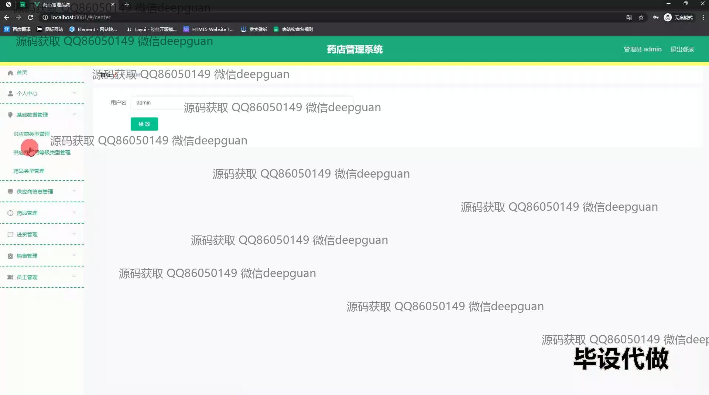
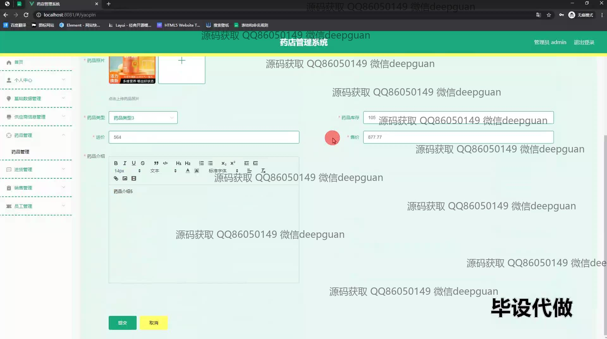
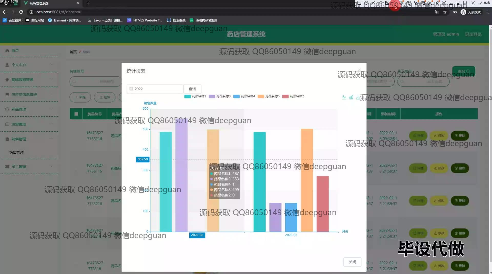
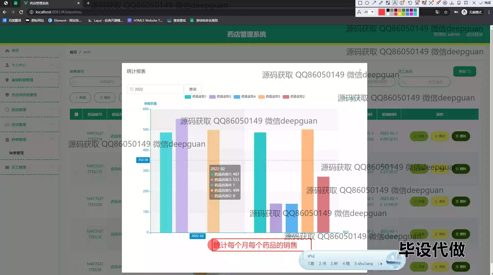
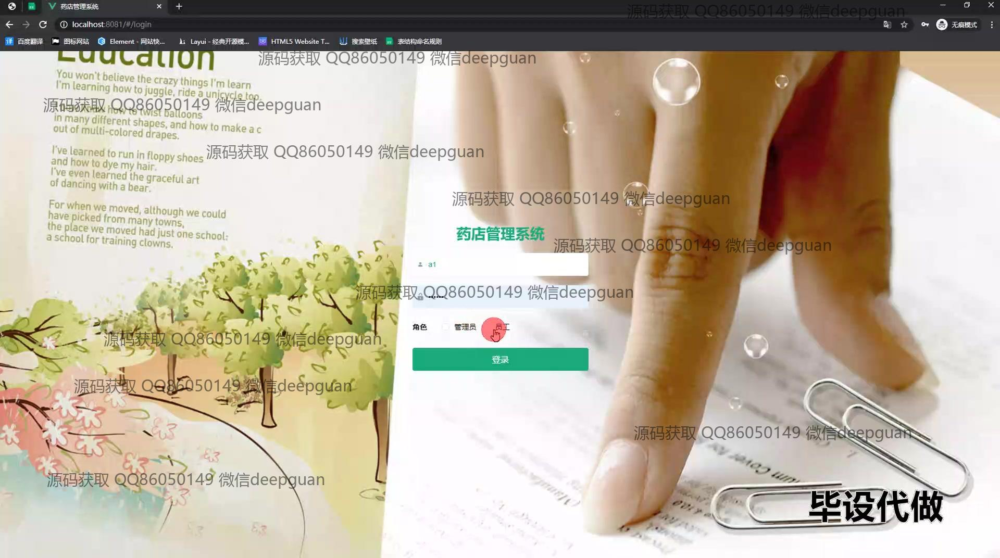
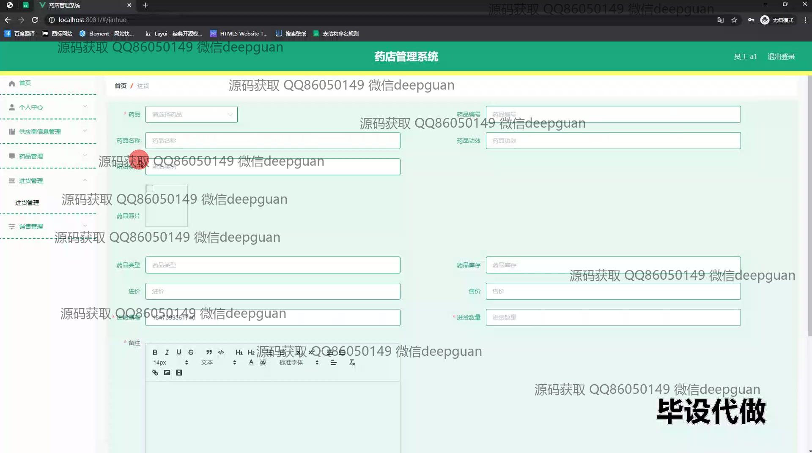
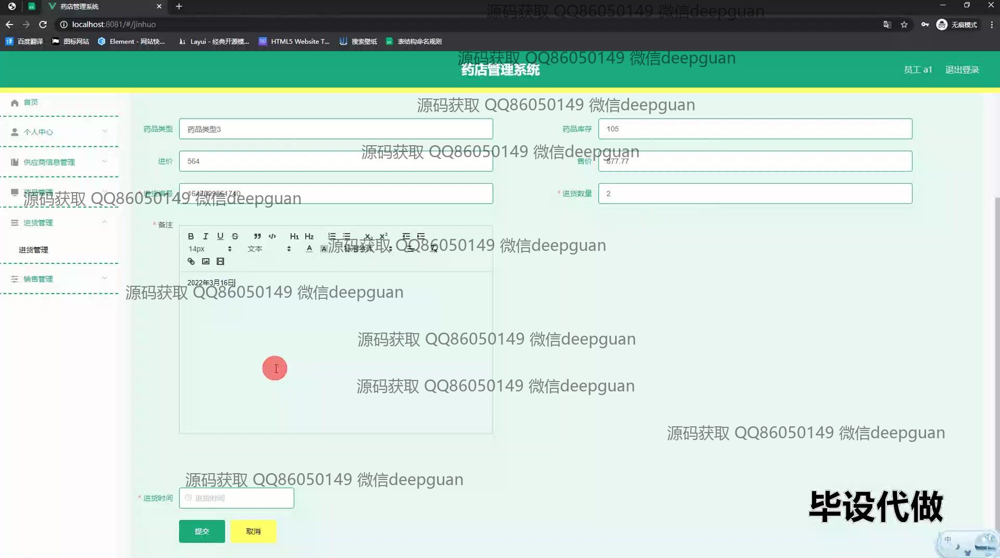
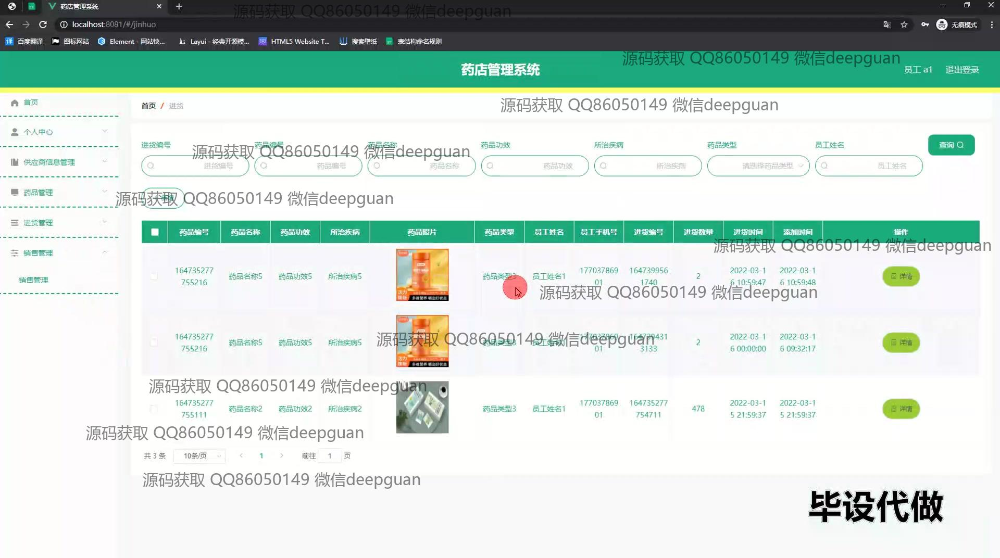
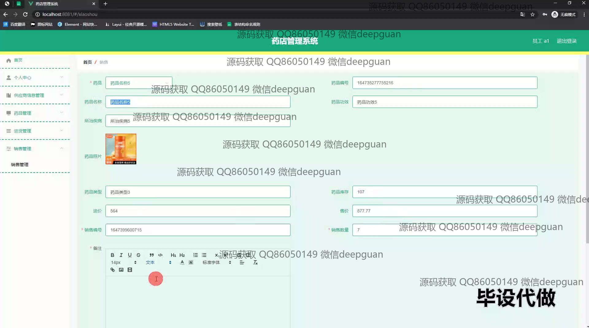
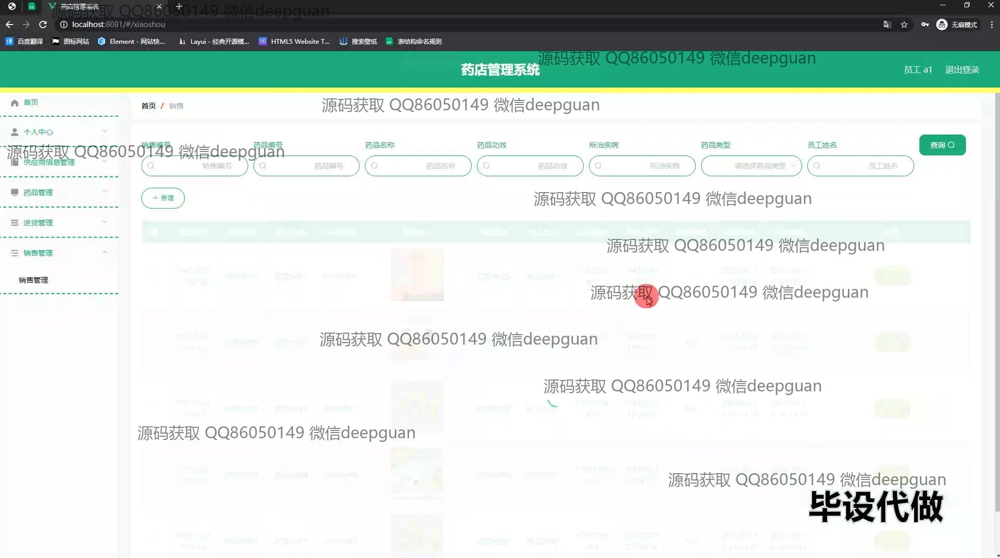

<h1 align="center">基于Java web的药店管理系统的设计与实现</h1>

## 简介
药店管理系统：角色分为管理员、用户；功能包括药品信息管理、供应商管理、销售管理、进货管理、员工管理，支持药品数据录入、统计报表及综合查询，提升药店运营效率。    --计算机毕业设计源码；毕设源码；java毕业设计源码

## 联系方式

<h3 align="center">获取完整代码与数据库文件 + 微信：deepguan QQ: 86050149 QQ群: 783742310</h3>

<h3 align="center">可帮忙远程部署 包运行成功！提供远程部署、修改代码、设计文档指导、代码讲解等服务！</h3>

## 功能介绍（完整见运行截图）
管理员：基本功能包括登录、退出以及角色选择，可以访问药店管理系统的各个功能模块。网站主页提供导航栏，用户可以通过导航进入个人中心、基础数据管理、供应商管理、药品管理、进货管理、销售管理和员工管理等模块。管理员可以查看和修改个人信息，管理供应商类型、药品类型、药品库存和各种销售、进货记录，还可以生成销售统计报表，以柱状图形式展示药品销售数据，实现对药店的全面管理和运营优化。

用户：通过系统登录访问个人中心、药品信息管理及进货和销售管理等界面。用户可以在药品管理模块中上传药品图片，输入药品编号、类型、进价、售价及描述等信息，实现药品信息的及时更新和查看。用户在系统中也能通过输入药品名称或药品编号进行快速搜索。销售管理模块提供了销售记录的管理以及销售数据的直观展示，帮助用户更好地监控药店运营状况及库存状态，为药品的日常管理提供有效支持。

## 运行截图

本代码来源于网络,仅供学习参考使用!

